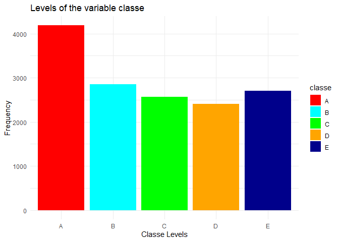
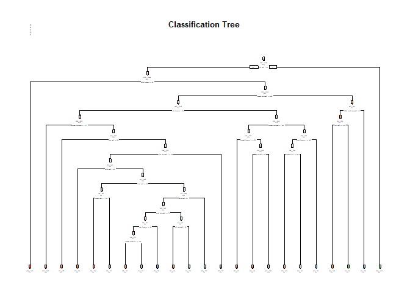

## Synopsis

With wearable devices like Jawbone Up, Nike FuelBand, and Fitbit, it's now easy to collect large amounts of personal activity data at a low cost. These devices are popular within the quantified self movement, where people track their behavior to improve health or identify patterns. While users often measure the quantity of their activity, they rarely assess the quality. In this project, data from accelerometers on the belt, forearm, arm, and dumbbell of six participants will be used to classify how well barbell lifts were performed, either correctly or in five different incorrect ways.

The goal of this project is to predict the manner in which they did the exercise. This is the **classe** variable in the training set.

## Data description

The outcome variable is classe, a factor variable with 5 levels. For this data set, participants were asked to perform one set of 10 repetitions of the Unilateral Dumbbell Biceps Curl in 5 different fashions:

- exactly according to the specification (Class A)
- throwing the elbows to the front (Class B)
- lifting the dumbbell only halfway (Class C)
- lowering the dumbbell only halfway (Class D)
- throwing the hips to the front (Class E)

## Initial configuration


``` r
# Data variables
training.file   <- './data/pml-training.csv'
test.cases.file <- './data/pml-testing.csv'
training.url    <- 'http://d396qusza40orc.cloudfront.net/predmachlearn/pml-training.csv'
test.cases.url  <- 'http://d396qusza40orc.cloudfront.net/predmachlearn/pml-testing.csv'

# Directories
if (!file.exists("data")){
  dir.create("data")
}
if (!file.exists("data/submission")){
  dir.create("data/submission")
}

# R-Packages

required_packages <- c("caret", "randomForest", "rpart", "rpart.plot")
new_packages <- required_packages[!(required_packages %in% installed.packages()[,"Package"])]
if(length(new_packages)) install.packages(new_packages, repos = "https://cran.rstudio.com/")
lapply(required_packages, library, character.only = TRUE)
```

```
## Loading required package: ggplot2
```

```
## Loading required package: lattice
```

```
## randomForest 4.7-1.2
```

```
## Type rfNews() to see new features/changes/bug fixes.
```

```
## 
## Attaching package: 'randomForest'
```

```
## The following object is masked from 'package:ggplot2':
## 
##     margin
```

``` r
# Set seed for reproducibility
set.seed(9999)
```

## Data Processing

In this section the data is downloaded and processed. Some basic transformations and cleanup will be performed, so that `NA` values are omitted. Irrelevant columns such as `user_name`, `raw_timestamp_part_1`, `raw_timestamp_part_2`, `cvtd_timestamp`, `new_window`, and  `num_window` (columns 1 to 7) will be removed in the subset.

The `pml-training.csv` data is used to devise training and testing sets.
The `pml-test.csv` data is used to predict and answer the 20 questions based on the trained model.


``` r
# Download data
download.file(training.url, training.file)
download.file(test.cases.url, test.cases.file)

# Clean data
training <- read.csv(training.file, na.strings=c("NA", "#DIV/0!", ""))
testing <- read.csv(test.cases.file, na.strings=c("NA", "#DIV/0!", ""))
training <- training[, colSums(is.na(training)) == 0]
testing <- testing[, colSums(is.na(testing)) == 0]

# Subset data
training <- training[, -c(1:7)]
testing <- testing[, -c(1:7)]
```

## Cross-validation
In this section cross-validation will be performed by splitting the training data in training (75%) and testing (25%) data.


``` r
library(caret)  # Ensure caret is loaded for createDataPartition
subSamples <- createDataPartition(y=training$classe, p=0.75, list=FALSE)
subTraining <- training[subSamples, ] 
subTesting <- training[-subSamples, ]
```


## Expected out-of-sample error

The expected out-of-sample error will correspond to the quantity: 
1-accuracy in the cross-validation data. 

Accuracy is the proportion of correct classified observation over the total sample in the subTesting data set. Expected accuracy is the expected accuracy in the out-of-sample data set (i.e. original testing data set).
Thus, the expected value of the out-of-sample error will correspond to the expected number of misclassified observations/total observations in the Test data set, which is the quantity:

1-accuracy found from the cross-validation data set.

## Exploratory analysis
The variable classe contains 5 levels. The plot of the outcome variable shows the frequency of each levels in the subTraining data.


``` r
# Check for missing values and print a summary
summary(subTraining$classe)
```

```
##    Length     Class      Mode 
##     14718 character character
```

``` r
# Ensure 'classe' is a factor
subTraining$classe <- as.factor(subTraining$classe)

# Create a table of counts for each level of 'classe'
classe_counts <- table(subTraining$classe)

# Check the structure of subTraining
str(subTraining)
```

```
## 'data.frame':	14718 obs. of  53 variables:
##  $ roll_belt           : num  1.41 1.42 1.48 1.45 1.42 1.42 1.43 1.45 1.45 1.43 ...
##  $ pitch_belt          : num  8.07 8.07 8.05 8.06 8.09 8.13 8.16 8.17 8.18 8.18 ...
##  $ yaw_belt            : num  -94.4 -94.4 -94.4 -94.4 -94.4 -94.4 -94.4 -94.4 -94.4 -94.4 ...
##  $ total_accel_belt    : int  3 3 3 3 3 3 3 3 3 3 ...
##  $ gyros_belt_x        : num  0.02 0 0.02 0.02 0.02 0.02 0.02 0.03 0.03 0.02 ...
##  $ gyros_belt_y        : num  0 0 0 0 0 0 0 0 0 0 ...
##  $ gyros_belt_z        : num  -0.02 -0.02 -0.03 -0.02 -0.02 -0.02 -0.02 0 -0.02 -0.02 ...
##  $ accel_belt_x        : int  -22 -20 -22 -21 -22 -22 -20 -21 -21 -22 ...
##  $ accel_belt_y        : int  4 5 3 4 3 4 2 4 2 2 ...
##  $ accel_belt_z        : int  22 23 21 21 21 21 24 22 23 23 ...
##  $ magnet_belt_x       : int  -7 -2 -6 0 -4 -2 1 -3 -5 -2 ...
##  $ magnet_belt_y       : int  608 600 604 603 599 603 602 609 596 602 ...
##  $ magnet_belt_z       : int  -311 -305 -310 -312 -311 -313 -312 -308 -317 -319 ...
##  $ roll_arm            : num  -128 -128 -128 -128 -128 -128 -128 -128 -128 -128 ...
##  $ pitch_arm           : num  22.5 22.5 22.1 22 21.9 21.8 21.7 21.6 21.5 21.5 ...
##  $ yaw_arm             : num  -161 -161 -161 -161 -161 -161 -161 -161 -161 -161 ...
##  $ total_accel_arm     : int  34 34 34 34 34 34 34 34 34 34 ...
##  $ gyros_arm_x         : num  0.02 0.02 0.02 0.02 0 0.02 0.02 0.02 0.02 0.02 ...
##  $ gyros_arm_y         : num  -0.02 -0.02 -0.03 -0.03 -0.03 -0.02 -0.03 -0.03 -0.03 -0.03 ...
##  $ gyros_arm_z         : num  -0.02 -0.02 0.02 0 0 0 -0.02 -0.02 0 0 ...
##  $ accel_arm_x         : int  -290 -289 -289 -289 -289 -289 -288 -288 -290 -288 ...
##  $ accel_arm_y         : int  110 110 111 111 111 111 109 110 110 111 ...
##  $ accel_arm_z         : int  -125 -126 -123 -122 -125 -124 -122 -124 -123 -123 ...
##  $ magnet_arm_x        : int  -369 -368 -372 -369 -373 -372 -369 -376 -366 -363 ...
##  $ magnet_arm_y        : int  337 344 344 342 336 338 341 334 339 343 ...
##  $ magnet_arm_z        : int  513 513 512 513 509 510 518 516 509 520 ...
##  $ roll_dumbbell       : num  13.1 12.9 13.4 13.4 13.1 ...
##  $ pitch_dumbbell      : num  -70.6 -70.3 -70.4 -70.8 -70.2 ...
##  $ yaw_dumbbell        : num  -84.7 -85.1 -84.9 -84.5 -85.1 ...
##  $ total_accel_dumbbell: int  37 37 37 37 37 37 37 37 37 37 ...
##  $ gyros_dumbbell_x    : num  0 0 0 0 0 0 0 0 0 0 ...
##  $ gyros_dumbbell_y    : num  -0.02 -0.02 -0.02 -0.02 -0.02 -0.02 -0.02 -0.02 -0.02 -0.02 ...
##  $ gyros_dumbbell_z    : num  0 0 -0.02 0 0 0 0 0 0 0 ...
##  $ accel_dumbbell_x    : int  -233 -232 -232 -234 -232 -234 -232 -235 -233 -233 ...
##  $ accel_dumbbell_y    : int  47 46 48 48 47 46 47 48 47 47 ...
##  $ accel_dumbbell_z    : int  -269 -270 -269 -269 -270 -272 -269 -270 -269 -270 ...
##  $ magnet_dumbbell_x   : int  -555 -561 -552 -558 -551 -555 -549 -558 -564 -554 ...
##  $ magnet_dumbbell_y   : int  296 298 303 294 295 300 292 291 299 291 ...
##  $ magnet_dumbbell_z   : num  -64 -63 -60 -66 -70 -74 -65 -69 -64 -65 ...
##  $ roll_forearm        : num  28.3 28.3 28.1 27.9 27.9 27.8 27.7 27.7 27.6 27.5 ...
##  $ pitch_forearm       : num  -63.9 -63.9 -63.9 -63.9 -63.9 -63.8 -63.8 -63.8 -63.8 -63.8 ...
##  $ yaw_forearm         : num  -153 -152 -152 -152 -152 -152 -152 -152 -152 -152 ...
##  $ total_accel_forearm : int  36 36 36 36 36 36 36 36 36 36 ...
##  $ gyros_forearm_x     : num  0.02 0.03 0.02 0.02 0.02 0.02 0.03 0.02 0.02 0.02 ...
##  $ gyros_forearm_y     : num  0 -0.02 -0.02 -0.02 0 -0.02 0 0 -0.02 0.02 ...
##  $ gyros_forearm_z     : num  -0.02 0 0 -0.03 -0.02 0 -0.02 -0.02 -0.02 -0.03 ...
##  $ accel_forearm_x     : int  192 196 189 193 195 193 193 190 193 191 ...
##  $ accel_forearm_y     : int  203 204 206 203 205 205 204 205 205 203 ...
##  $ accel_forearm_z     : int  -216 -213 -214 -215 -215 -213 -214 -215 -214 -215 ...
##  $ magnet_forearm_x    : int  -18 -18 -16 -9 -18 -9 -16 -22 -17 -11 ...
##  $ magnet_forearm_y    : num  661 658 658 660 659 660 653 656 657 657 ...
##  $ magnet_forearm_z    : num  473 469 469 478 470 474 476 473 465 478 ...
##  $ classe              : Factor w/ 5 levels "A","B","C","D",..: 1 1 1 1 1 1 1 1 1 1 ...
```

``` r
# Create bar plot with multiple colors
library(ggplot2)
print(levels(subTraining$classe))
```

```
## [1] "A" "B" "C" "D" "E"
```

``` r
# Define colors for each class
color_values <- c("A" = "red", 
                  "B" = "cyan", 
                  "C" = "green", 
                  "D" = "orange", 
                  "E" = "darkblue")

# Create the bar plot
ggplot(subTraining, aes(x=classe, fill=classe)) + 
  geom_bar() + 
  scale_fill_manual(values=color_values) +
  labs(title="Levels of the variable classe", 
       x="Classe Levels", 
       y="Frequency") +
  theme_minimal()
```

<!-- -->


## Prediction models
In this section a decision tree and random forest will be applied to the data.

## Decison Tree


``` r
# Check structure of the data
str(subTraining)
```

```
## 'data.frame':	14718 obs. of  53 variables:
##  $ roll_belt           : num  1.41 1.42 1.48 1.45 1.42 1.42 1.43 1.45 1.45 1.43 ...
##  $ pitch_belt          : num  8.07 8.07 8.05 8.06 8.09 8.13 8.16 8.17 8.18 8.18 ...
##  $ yaw_belt            : num  -94.4 -94.4 -94.4 -94.4 -94.4 -94.4 -94.4 -94.4 -94.4 -94.4 ...
##  $ total_accel_belt    : int  3 3 3 3 3 3 3 3 3 3 ...
##  $ gyros_belt_x        : num  0.02 0 0.02 0.02 0.02 0.02 0.02 0.03 0.03 0.02 ...
##  $ gyros_belt_y        : num  0 0 0 0 0 0 0 0 0 0 ...
##  $ gyros_belt_z        : num  -0.02 -0.02 -0.03 -0.02 -0.02 -0.02 -0.02 0 -0.02 -0.02 ...
##  $ accel_belt_x        : int  -22 -20 -22 -21 -22 -22 -20 -21 -21 -22 ...
##  $ accel_belt_y        : int  4 5 3 4 3 4 2 4 2 2 ...
##  $ accel_belt_z        : int  22 23 21 21 21 21 24 22 23 23 ...
##  $ magnet_belt_x       : int  -7 -2 -6 0 -4 -2 1 -3 -5 -2 ...
##  $ magnet_belt_y       : int  608 600 604 603 599 603 602 609 596 602 ...
##  $ magnet_belt_z       : int  -311 -305 -310 -312 -311 -313 -312 -308 -317 -319 ...
##  $ roll_arm            : num  -128 -128 -128 -128 -128 -128 -128 -128 -128 -128 ...
##  $ pitch_arm           : num  22.5 22.5 22.1 22 21.9 21.8 21.7 21.6 21.5 21.5 ...
##  $ yaw_arm             : num  -161 -161 -161 -161 -161 -161 -161 -161 -161 -161 ...
##  $ total_accel_arm     : int  34 34 34 34 34 34 34 34 34 34 ...
##  $ gyros_arm_x         : num  0.02 0.02 0.02 0.02 0 0.02 0.02 0.02 0.02 0.02 ...
##  $ gyros_arm_y         : num  -0.02 -0.02 -0.03 -0.03 -0.03 -0.02 -0.03 -0.03 -0.03 -0.03 ...
##  $ gyros_arm_z         : num  -0.02 -0.02 0.02 0 0 0 -0.02 -0.02 0 0 ...
##  $ accel_arm_x         : int  -290 -289 -289 -289 -289 -289 -288 -288 -290 -288 ...
##  $ accel_arm_y         : int  110 110 111 111 111 111 109 110 110 111 ...
##  $ accel_arm_z         : int  -125 -126 -123 -122 -125 -124 -122 -124 -123 -123 ...
##  $ magnet_arm_x        : int  -369 -368 -372 -369 -373 -372 -369 -376 -366 -363 ...
##  $ magnet_arm_y        : int  337 344 344 342 336 338 341 334 339 343 ...
##  $ magnet_arm_z        : int  513 513 512 513 509 510 518 516 509 520 ...
##  $ roll_dumbbell       : num  13.1 12.9 13.4 13.4 13.1 ...
##  $ pitch_dumbbell      : num  -70.6 -70.3 -70.4 -70.8 -70.2 ...
##  $ yaw_dumbbell        : num  -84.7 -85.1 -84.9 -84.5 -85.1 ...
##  $ total_accel_dumbbell: int  37 37 37 37 37 37 37 37 37 37 ...
##  $ gyros_dumbbell_x    : num  0 0 0 0 0 0 0 0 0 0 ...
##  $ gyros_dumbbell_y    : num  -0.02 -0.02 -0.02 -0.02 -0.02 -0.02 -0.02 -0.02 -0.02 -0.02 ...
##  $ gyros_dumbbell_z    : num  0 0 -0.02 0 0 0 0 0 0 0 ...
##  $ accel_dumbbell_x    : int  -233 -232 -232 -234 -232 -234 -232 -235 -233 -233 ...
##  $ accel_dumbbell_y    : int  47 46 48 48 47 46 47 48 47 47 ...
##  $ accel_dumbbell_z    : int  -269 -270 -269 -269 -270 -272 -269 -270 -269 -270 ...
##  $ magnet_dumbbell_x   : int  -555 -561 -552 -558 -551 -555 -549 -558 -564 -554 ...
##  $ magnet_dumbbell_y   : int  296 298 303 294 295 300 292 291 299 291 ...
##  $ magnet_dumbbell_z   : num  -64 -63 -60 -66 -70 -74 -65 -69 -64 -65 ...
##  $ roll_forearm        : num  28.3 28.3 28.1 27.9 27.9 27.8 27.7 27.7 27.6 27.5 ...
##  $ pitch_forearm       : num  -63.9 -63.9 -63.9 -63.9 -63.9 -63.8 -63.8 -63.8 -63.8 -63.8 ...
##  $ yaw_forearm         : num  -153 -152 -152 -152 -152 -152 -152 -152 -152 -152 ...
##  $ total_accel_forearm : int  36 36 36 36 36 36 36 36 36 36 ...
##  $ gyros_forearm_x     : num  0.02 0.03 0.02 0.02 0.02 0.02 0.03 0.02 0.02 0.02 ...
##  $ gyros_forearm_y     : num  0 -0.02 -0.02 -0.02 0 -0.02 0 0 -0.02 0.02 ...
##  $ gyros_forearm_z     : num  -0.02 0 0 -0.03 -0.02 0 -0.02 -0.02 -0.02 -0.03 ...
##  $ accel_forearm_x     : int  192 196 189 193 195 193 193 190 193 191 ...
##  $ accel_forearm_y     : int  203 204 206 203 205 205 204 205 205 203 ...
##  $ accel_forearm_z     : int  -216 -213 -214 -215 -215 -213 -214 -215 -214 -215 ...
##  $ magnet_forearm_x    : int  -18 -18 -16 -9 -18 -9 -16 -22 -17 -11 ...
##  $ magnet_forearm_y    : num  661 658 658 660 659 660 653 656 657 657 ...
##  $ magnet_forearm_z    : num  473 469 469 478 470 474 476 473 465 478 ...
##  $ classe              : Factor w/ 5 levels "A","B","C","D",..: 1 1 1 1 1 1 1 1 1 1 ...
```

``` r
# Convert factor columns to numeric if needed
# Make sure 'classe' is a factor
subTraining$classe <- as.factor(subTraining$classe)

# Identify non-numeric columns
non_numeric_cols <- sapply(subTraining, function(x) !is.numeric(x) && !is.factor(x))

if (any(non_numeric_cols)) {
  # Optionally, print non-numeric columns
  print(colnames(subTraining)[non_numeric_cols])
  
  # You can either convert these columns or remove them
  # Convert to numeric or handle appropriately
  # Here, we will remove non-numeric columns
  subTraining <- subTraining[, !non_numeric_cols]
}

# Fit model
modFitDT <- rpart(classe ~ ., data=subTraining, method="class")

# Perform prediction
predictDT <- predict(modFitDT, subTesting, type="class")

# Plot result
rpart.plot(modFitDT, main="Classification Tree", extra=102, under=TRUE, faclen=0)
```

<!-- -->


## Random Forest


``` r
# Fit model
modFitRF <- randomForest(classe ~ ., data=subTraining, method="class")

# Perform prediction
predictRF <- predict(modFitRF, subTesting, type = "class")

# Ensure both are factors and have the same levels
predictRF <- as.factor(predictRF)
subTesting$classe <- as.factor(subTesting$classe)

# Set levels to be the same
levels(predictRF) <- levels(subTesting$classe)

# Generate the confusion matrix
cm_rf <- confusionMatrix(predictRF, subTesting$classe)
print(cm_rf)
```

```
## Confusion Matrix and Statistics
## 
##           Reference
## Prediction    A    B    C    D    E
##          A 1393    5    0    0    0
##          B    2  943    2    0    0
##          C    0    1  853    8    0
##          D    0    0    0  795    2
##          E    0    0    0    1  899
## 
## Overall Statistics
##                                           
##                Accuracy : 0.9957          
##                  95% CI : (0.9935, 0.9973)
##     No Information Rate : 0.2845          
##     P-Value [Acc > NIR] : < 2.2e-16       
##                                           
##                   Kappa : 0.9946          
##                                           
##  Mcnemar's Test P-Value : NA              
## 
## Statistics by Class:
## 
##                      Class: A Class: B Class: C Class: D Class: E
## Sensitivity            0.9986   0.9937   0.9977   0.9888   0.9978
## Specificity            0.9986   0.9990   0.9978   0.9995   0.9998
## Pos Pred Value         0.9964   0.9958   0.9896   0.9975   0.9989
## Neg Pred Value         0.9994   0.9985   0.9995   0.9978   0.9995
## Prevalence             0.2845   0.1935   0.1743   0.1639   0.1837
## Detection Rate         0.2841   0.1923   0.1739   0.1621   0.1833
## Detection Prevalence   0.2851   0.1931   0.1758   0.1625   0.1835
## Balanced Accuracy      0.9986   0.9963   0.9977   0.9942   0.9988
```

## Conclusion

### Result

The confusion matrices show, that the Random Forest algorithm performens better than decision trees. The accuracy for the Random Forest model was 0.995 (95% CI: (0.993, 0.997)) compared to 0.739 (95% CI: (0.727, 0.752)) for Decision Tree model. The random Forest model is choosen.

### Expected out-of-sample error
The expected out-of-sample error is estimated at 0.005, or 0.5%. The expected out-of-sample error is calculated as 1 - accuracy for predictions made against the cross-validation set. Our Test data set comprises 20 cases. With an accuracy above 99% on our cross-validation data, we can expect that very few, or none, of the test samples will be missclassified.
